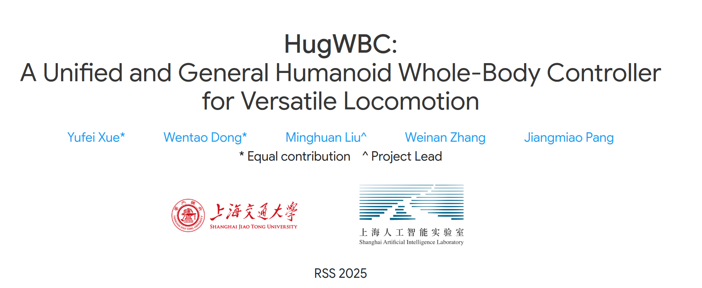
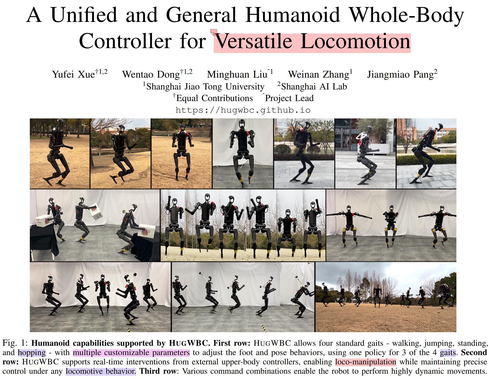
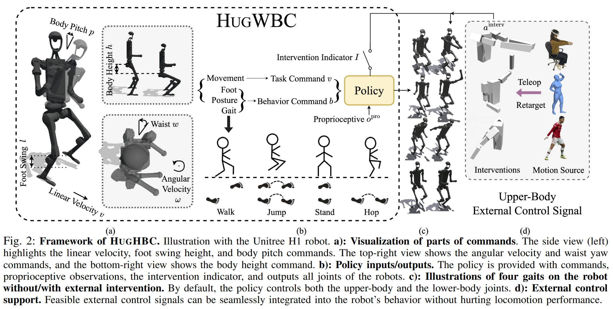
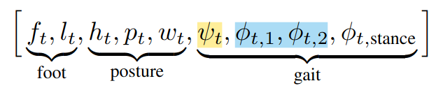
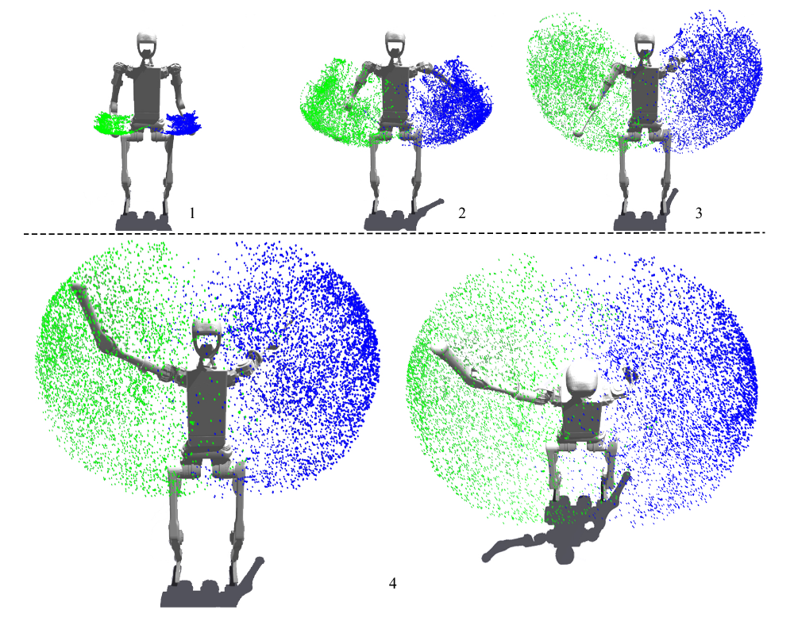
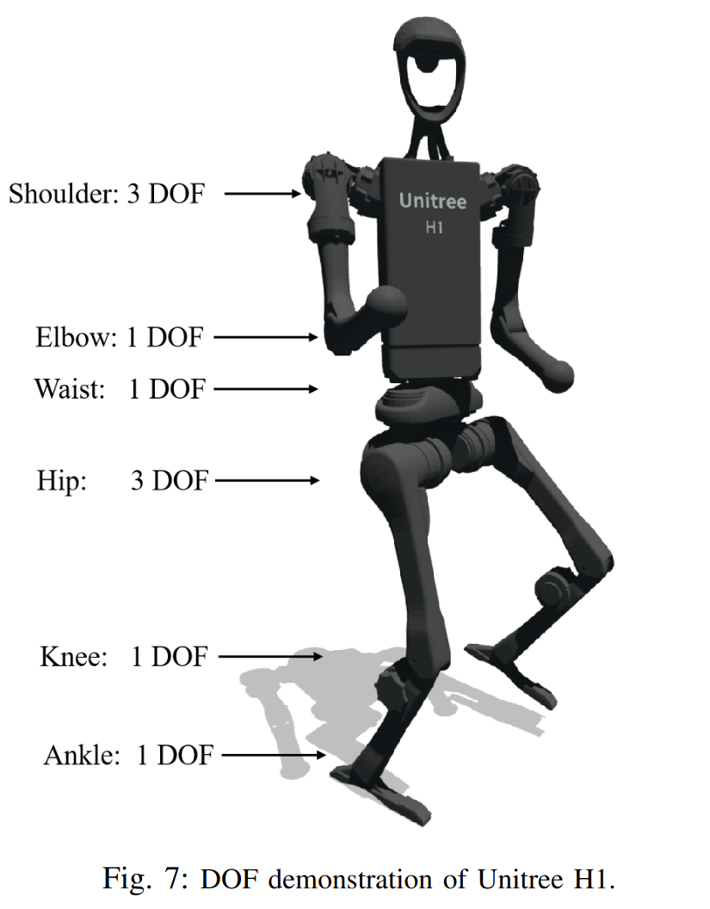

# 从HUGWBC学通强化学习运动控制

## 项目背景

HUGWBC是上海交通大学和AI Lab团队联合发表在RSS2025上的一篇关于通用人形机器人全身运动控制器的文章

https://arxiv.org/abs/2502.03206

HUGWBC目前代码已开源，项目链接如下

https://hugwbc.github.io/

该项目主要通过强化学习，训练H1机器人全身运动，通过特殊的command设计，将多种步态融合进控制接口，通过发布不同指令实现机器人多步态的切换；同时，基于强化学习中奖励函数的设计，HUGWBC将行走、站立、双脚跳跃融合进了一个Policy中，让H1的Locomotion更加General和Versatile

作为笔者第一个人形机器人项目，同时也是笔者的毕业设计，我拟结合代码完整地梳理一下HUGWBC的设计思路和构造，并尝试将其迁移到G1等机器人上，查看训练效果，最终目标是完成在G1等机器人的框架迁移、Sim2Sim和Sim2Real

接下来，让我们走进HUGWBC，去看看强化学习视角下，人形机器人的控制设计。

## 走进HUGWBC

### 概览

运动作为人形机器人的一项基本技能，如何突破单一策略控制下运动单一、不可扩展的挑战，是人形机器人运控的一大主题。简单来说，就是如何最简洁高效地赋予人形机器人通用性的运动能力。

在技术路线那篇文章中，我们提到，现有的工作方向主要是两个方面：

1. 通过强化学习，设计奖励函数和目标，通过奖励和正则化来“推拉”机器人学习到不会让自己摔倒、同时又能响应指令运动的策略网络(`Unitree_rl_gym`、`Humanoid_gym`、`HugWBC`)
2. 通过大规模的数据集做模仿学习，让机器人从Motion Tracking开始，有监督地掌握各项运动性能，并发挥在LLM领域大放异彩的Scaling Law(规模效应)和扩散模型、流匹配模型还有蒸馏的方法，将多个运动策略蒸馏到一个统一的Policy下，从而让机器人在大规模学习中提升运动的通用性（`BeyondMimic`、`SONIC`、`OmniXtreme`）

在过去的五年时间里，技术整体上呈现一个先1后2的发展方向，我认为这主要是源自早期强化学习尤其是PPO在实体机器人部署上的成功以及数据集的匮乏所演变的自然结果，并在越来越多的资源投向具身智能领域、尤其是VLA后，后者在未来的应用领域会更大。

在这个背景下，HUGWBC在一定程度上为传统的纯强化学习做了技术上的集成和扩展，作为人形机器人运动控制技能树上的一个枝桠，具有很高的学习和参考价值。

### 框架

上图是HUGWBC论文中展示的整体框架。我们简易拆分一下这个框架：

1）左侧，框架展示了HUGWBC对单体机器人的控制指令的组成，主要有两个部分：Task Command 和 Behavior Command。其中，Task Command主要负责给出H1运动的各类任务指标，主要是$[V_x,V_y,V_{yaw}]$这三部分，也即发出机器人运动的线速度和角速度指令；Behavior Command则主要负责给出H1运动时的各种表现指令，主要是$[Foot, Posture,Gait]$三个部分，其中$Foot$主要包括$[Foot Phase,FootDuration]$两项，分别给出机器人两足的相位差和接触/悬空的占空比；$Posture$部分主要包括$[Waist,BodyHeight,BodyPitch]$，$Gait$则主要包括$[FootFrequence,FootSwingHeight]$。其中Foot和Gait部分感觉可以合并到一起，统称为机器人的步态。

2）右侧，框架展示了HUGWBC上肢的干预——如果有遥操作或者其他外部操作给到上肢，上肢则通过Intervention Indicator给到策略接管上肢操作。在仿真环境中，也可以演示噪声接管下机器人的运动状态。

总体来说这个框架在人形机器人强化学习运控中是非常有效的：一方面，通过指令集的有机结合，控制器可以响应指令给出机器人不同姿态的控制信号，让机器人执行对应的步态和姿态；另一方面，通过噪声课程学习，HUGWBC比较好地实现了上下半身的解耦，从而在上半身作出大规模动作时，下半身依旧能维持自身稳定状态，甚至在不同的步态下运动、平衡。

做一些发散性的思考：如果在hugwbc的基础上再给机器人做更高层的规划，比如视觉语言动作模型，给出机器人到达点位的指令，让机器人平稳抵达目标位置，实质上就完成了很多实践当中的任务。当然这还是属于分层规划的范畴。

但总的来说，HUGWBC为机器人提供了一个更加统一通用的底层控制器，为后续很多任务的执行铺路，这也是笔者认为人形运控这个领域研究的核心意义——构建一个统一通用的运动模组

### 技术细节

如何关注一个强化学习工作的技术细节？经过笔者一段时间的摸索，我认为人形机器人强化学习领域的很多技术可以按如下视角入手

#### 1.仿真环境设计

在强化学习算法迭代至今，核心算法大致定型，对于工程上的问题，如何实现一个仿真环境来给机器人做“交互”，成为许多强化学习工作要做的第一步。

在文章中作者并为过多提及仿真环境设计的内容——这主要是因为HUGWBC关注的是机器人在常态条件下的行动能力，而非像楼梯那样的非结构化地形、或者像规定落脚点那样的特定任务场景。

作者采用Isaac Gym模拟器，沿用了Legged_gym的设计

#### 2.人形机器人配置

上图为HUGWBC使用的H1机器人，如图所示，H1共有19个关节，其中上肢有8个关节，腰部有1个关节，腿部有10个关节

#### 3.奖励函数设计

#### 4.强化学习算法设计

#### 5.训练设计

